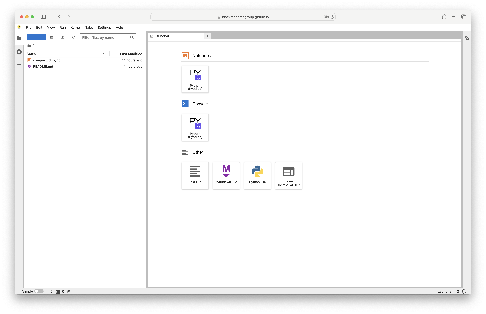

# BRG Code in JupyterLite

This repository hosts a set of notebooks that provide a low threshold introduction
to the solvers and other tools available at the [BlockResearchGroup organization](https://github.com/blockresearchgroup) on GitHub.

## Getting Started

Getting started is easy.
Just go to the [brg-jupyterlite]([https://](https://blockresearchgroup.github.io/brg-jupyterlite)) web page,
open one of the notebooks, and start running the cells.
No need to install anything thanks to [Jupyterlite](https://jupyterlite.readthedocs.io/en/stable/)
and [Pyodide](https://pyodide.org/en/stable/)!

## Jupyterlab

The default interface is the one of [JupyterLab](https://jupyterlab.readthedocs.io/en/latest/).
This means that, initially, you will see a sidebar with a "File Browser", and a main window with a "Launcher".

Double-click on one of the notebooks in the sidebar, choose the "Pyodide Kernel" if it is not already selected,
and start running the cells, or run all of the cells at once.

## Notebooks

In the File Browser, you will find notebooks for many of the packages available at <https://github.com/blockresearchgroup> (not yet, but soon :).

When you make changes to these notebooks, your browser will store those changes locally.
If you want to reset one of the predefined notebooks to its original state, just delete it.
It will automatically reload the latest version from the repository.

## Issues

If one of the notebooks doesn't work, or if you have other problems with the website,
please let us know via the [Issue Tracker](https://github.com/BlockResearchGroup/brg-jupyterlite/issues).
